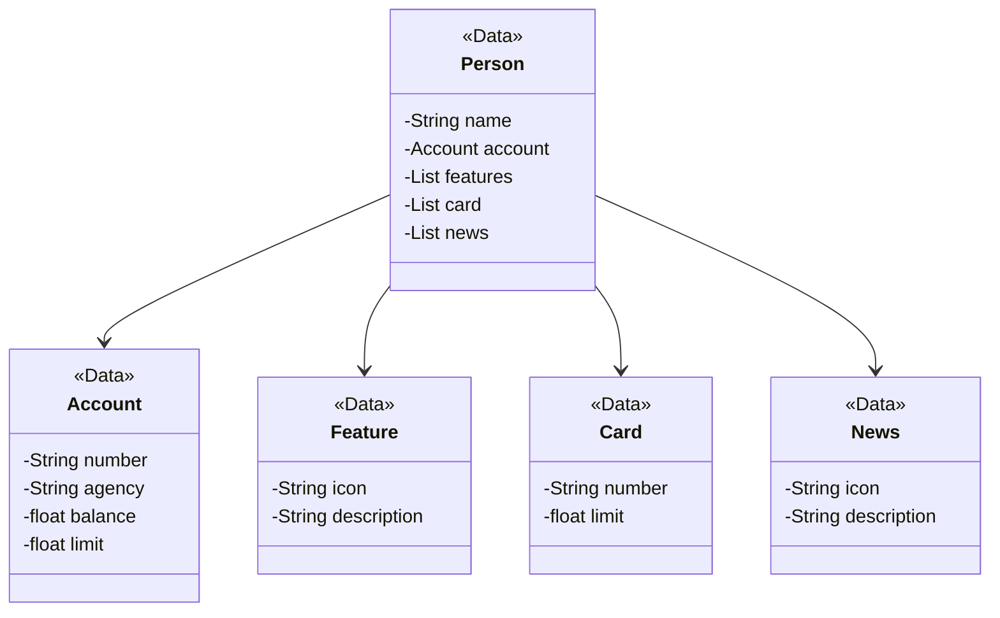

<h1>
    
    
<h1>  
    
</h1>

API desenvolvida para o bootcamp JAVA AI Powered 

Projeto do Bootcamp:
[DIO Java AI Powered](https://web.dio.me/track/coding-future-tonnie-java-ai-powered)

[Publicando sua API REST na nuvem usando Spring Boot 3, Java 17 e Railway](https://web.dio.me/lab/publicando-sua-api-rest-na-nuvem-usando-spring-boot-3-java-17-e-railway/learning/7dc1b5d6-8b18-4df2-98c4-15de3939f2b7)

### Diagrama de classes

